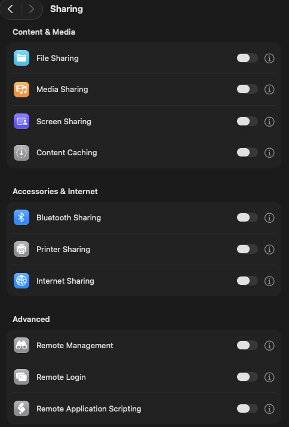
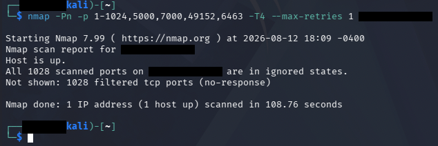
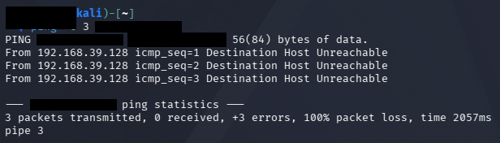
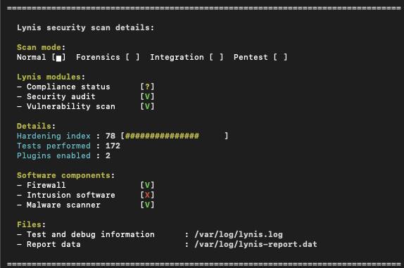

# macOS Hardening Baseline — MacBook Pro M2

Hardening the highest-value machine in my home lab: my daily driver. This MacBook runs my VMware Fusion attack/target lab, holds the only SSH private key to my internet-exposed Wazuh SIEM VPS, and handles everything else I do. If this machine gets compromised, everything downstream goes with it. That made it the right target for a baseline → remediate → verify project.

**Format:** capture a full "before" picture with evidence, audit against a standard, remediate, then verify the changes from the outside — the same assess/remediate/verify loop used in vulnerability management.

## Environment

- MacBook Pro M2 (Apple Silicon), macOS Tahoe 26.5.2 at baseline, 26.6.1 after patching
- Role: daily driver + lab host (VMware Fusion running Kali and Ubuntu Server VMs)
- Audit tooling: [Lynis](https://github.com/CISOfy/lynis) (run from a tarball — no install), CIS Apple macOS Benchmark as the reference standard, `lsof`/`nmap` for effective-state checks
- Attacker vantage point for verification: Kali VM on the same LAN

I deliberately ran Lynis from a downloaded tarball instead of installing it through a package manager. I was about to take a "before" measurement — installing Homebrew and packages first would have modified the system I was measuring.

## Phase 1 — Baseline

Everything captured read-only into an evidence folder before changing anything: system version, SIP, FileVault, Gatekeeper, firewall state, listening ports (`sudo lsof -i -P -n | grep LISTEN`), Remote Login, sharing services, auto-update settings, guest account.

**Already in good shape:** SIP enabled, FileVault on, Gatekeeper enabled, Remote Login off, all Sharing services off, guest account disabled, automatic updates fully enabled.



**Findings:**

| # | Finding | Detail |
|---|---------|--------|
| 1 | Application firewall disabled | Stealth mode also off |
| 2 | AirPlay Receiver exposed | Control Center listening on `*:5000` and `*:7000` (all interfaces) |
| 3 | Pending OS security update | 26.6.1 available, machine on 26.5.2 |
| 4 | rapportd listening on all interfaces | AirDrop/Handoff service |
| 5 | Unknown loopback listener | `launchd` holding `127.0.0.1:8021` — owner unknown at baseline |

The AirPlay finding came from reading the `lsof` output, not from a settings pane — ports 5000/7000 on `*` are the AirPlay Receiver, which I never use.

## Phase 2 — Scored audit

Lynis baseline: **hardening index 75** (172 tests).


One note on the summary output: Lynis showed Firewall `[V]` even with the application firewall off — it was detecting `pf`, the BSD packet filter macOS always ships with, not the application firewall. Worth knowing what a checkmark actually means before trusting it.

Triage of the suggestions list mattered as much as the scan. Lynis is a Linux-first tool, so several findings don't apply to macOS and I documented them as N/A with reasons instead of "fixing" them: the symlinked `/home`, `/tmp`, `/var` mounts are macOS firmlinks by design; the Apache module suggestions were cross-referenced against my own port baseline — httpd isn't running or listening, no action; PAM password modules are Linux advice (macOS uses `pwpolicy`); restricting compilers to root made no sense on a machine I develop on. Real actions from Lynis: disable `com.apple.ftp-proxy`, and check home directory permissions.

## Phase 3 — Remediation

| # | Change | Verification |
|---|--------|--------------|
| 1 | Applied macOS 26.6.1 update | `sw_vers` post-restart |
| 2 | Enabled application firewall + stealth mode | `socketfilterfw --getglobalstate`; survived reboot; lab VM networking and VPS SSH re-tested immediately after |
| 3 | Disabled AirPlay Receiver | `lsof` — ports 5000/7000 gone, stayed gone after reboot |
| 4 | Disabled `com.apple.ftp-proxy` | `launchctl print-disabled` + port 8021 released (see Challenges) |
| 5 | Tightened home directory 750 → 700 | `ls -ld`; `~/.ssh` verified already correct (700 dir, 600 private key) |
| 6 | AirDrop restriction | Verified already set to Contacts Only (default confirmed, not changed) |
| 7 | rapportd | Retained deliberately — see Accepted Risks |

After enabling the firewall I immediately re-tested what it could have broken: Kali↔Ubuntu VM networking (ping + nmap between VMs) and SSH from this Mac to my VPS. All fine. Verify your hardening didn't break the things you actually use, before moving on.

## Phase 4 — Verification from the attacker's side

From the Kali VM, a full 65,535-port scan against the hardened Mac was abandoned after hours at 7% — with stealth mode silently dropping every probe, each port has to fully time out. The scan being that expensive is itself the result.

A targeted scan of ~1,000 common ports plus every port from this project's story:

```
Nmap scan report for <MAC_LAN_IP>
Host is up.
All 1028 scanned ports on <MAC_LAN_IP> are in ignored states.
Not shown: 1028 filtered tcp ports (no-response)
```



Ports 5000 and 7000 — open at baseline — now give no response. So does 49152, the port belonging to rapportd, the service I kept: still running, invisible to unsolicited probes.

An ICMP (ping) test came back 100% loss, but I didn't count it: the errors said `Destination Host Unreachable` from the Kali VM's own NAT gateway, so I ran a control ping against my router — also unreachable. VMware's NAT was passing TCP but dropping ICMP, which made the ping test invalid from that vantage point, not passed. The TCP scan carries the proof on its own.



Lynis rescan: **hardening index 78** (from 75).

 The small movement is honest and worth explaining: Lynis's macOS test coverage is shallow — it doesn't score the application firewall, doesn't know AirPlay Receiver exists, and can't see most of what changed. The meaningful before/after is the exposure table above, not the index. Knowing what your scanner can't measure is half of using one. The suggestion-list diff did confirm the ftp-proxy fix (INSE-8050 cleared between runs).

## Challenges & Lessons

**The AirPlay ports that wouldn't die — because I never turned them off.** After "disabling" AirPlay Receiver, `lsof` still showed 5000/7000 listening. I restarted Control Center (respawned, still listening), read its preference file (empty), and started suspecting the firewall's built-in-software allowance — then re-checked the settings pane and found the toggle still on. The first "off" never happened. Flipped it, bounced the process, ports gone. Lesson: when a port won't die, verify the setting actually changed before hunting exotic causes.

**The mystery port 8021 and launchd socket activation.** An unknown listener on `127.0.0.1:8021` showed as owned by `launchd` (PID 1). macOS uses socket activation: launchd holds sockets on behalf of on-demand services and only spawns them if a connection arrives — so `lsof` names the janitor, not the tenant. Grepping the LaunchDaemons plists for `8021` pointed at `com.apple.ftp-proxy` (with two false positives from 802.1X services — worth understanding why a grep matched before trusting it). Final attribution came by experiment: `launchctl bootout` of ftp-proxy, and the 8021 socket vanished on the next `lsof`. The mystery listener and the Lynis ftp-proxy finding were the same finding.

**The disable that reverted.** `launchctl disable` on ftp-proxy was verified, then found flipped back to enabled after rebooting into the 26.6.1 update. The most likely cause is the OS update rebuilding launchd's service overrides — notably `com.apple.ftpd` stayed disabled, but that's Apple's shipped default rather than my override, which fits the update-restore theory. Re-disabled post-update; persistence across the next normal reboot to be confirmed. Broader lesson, which this project taught me three separate times: `disable` is a promise about the future, `bootout` is an action in the present, and `lsof` is the only vote that counts. Config, policy, and effective state are three different layers — check the one that matters.

**The ping test I threw out.** A 100% packet loss result looked like a stealth-mode win until I read where the errors originated. A control test against a known-good target invalidated my own evidence. Before trusting a negative result, prove the probe can succeed against something.

**The scanner that reads comments as usernames.** Lynis kept flagging home-directory permissions after my fix. The log showed why: it parses `/etc/passwd` line-by-line like a Linux box — on macOS that file is only consulted in single-user mode (real accounts live in Open Directory), and Lynis was literally "checking" the comment lines explaining that. The actual residual flag was `/var/spool/uucp`, the home of a legacy UUCP service account — my directory had passed. Tightened it to 750 anyway as scanner hygiene, not as a security win. Lesson: a finding that persists after remediation is a question, not a verdict — read the log to learn whether you missed, or the scanner did.

## Accepted Risks & Out of Scope

- **rapportd (AirDrop/Handoff) retained.** I occasionally AirDrop with my phone. Exposure is mitigated three ways: AirDrop restricted to Contacts Only, stealth mode drops unsolicited probes (verified — its port returned no-response in the Kali scan), and the realistic threat requires an attacker already on my LAN. Turning it off would trade a real workflow for near-zero marginal gain.
- **`/Users/Shared` world-writable.** Ships that way, with the sticky bit — same semantics as `/tmp`. Expected default, no action.
- **No MDM, no third-party EDR.** Personal machine; enterprise controls are out of scope here.
- **ftp-proxy disable persistence** pending confirmation across the next normal reboot (see Challenges).

## Future Work

- Confirm ftp-proxy disable persistence; if it reverts again without an update involved, investigate what re-asserts it
- Scan this hardened machine with Nessus Essentials (next project) — scan/fix/rescan against a real target
- Periodic re-baseline: re-run the `lsof` capture and Lynis after macOS point updates, since updates can change service state (this project caught one doing exactly that)
