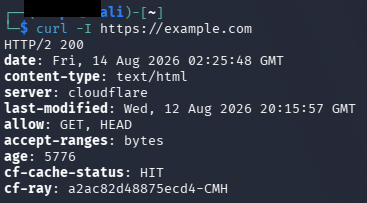
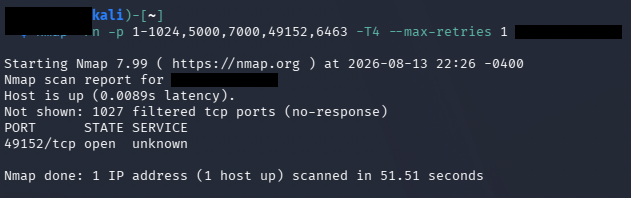

[README.md](https://github.com/user-attachments/files/31051410/README.md)# macOS Hardening Baseline — MacBook Pro M2

Hardening the highest-value machine in my home lab: my daily driver. This MacBook runs my VMware Fusion attack/target lab, holds the only SSH private key to my internet-exposed Wazuh SIEM VPS, and handles everything else I do. If this machine gets compromised, everything downstream goes with it. That made it the right target for a baseline → remediate → verify project.

**Format:** capture a full "before" picture with evidence, audit against a standard, remediate, then verify the changes from the outside — the same assess/remediate/verify loop used in vulnerability management.

## Environment

- MacBook Pro M2 (Apple Silicon), macOS Tahoe 26.5.2 at baseline, 26.6.1 after patching
- Role: daily driver + lab host (VMware Fusion running Kali and Ubuntu Server VMs)
- Audit tooling: [Lynis](https://github.com/CISOfy/lynis) (run from a tarball — no install), CIS Apple macOS Benchmark as the reference standard, `lsof`/`nmap` for effective-state checks
- Attacker vantage point for verification: Kali VM on the same LAN

I deliberately ran Lynis from a downloaded tarball instead of installing it through a package manager. I was about to take a "before" measurement — installing Homebrew and packages first would have modified the system I was measuring.

## Phase 1 — Baseline

Everything captured read-only into an evidence folder before changing anything: system version, SIP, FileVault, Gatekeeper, firewall state, listening ports (`sudo lsof -i -P -n | grep LISTEN`), Remote Login, sharing services, auto-update settings, guest account.

**Already in good shape:** SIP enabled, FileVault on, Gatekeeper enabled, Remote Login off, all Sharing services off, guest account disabled, automatic updates fully enabled.


**Findings:**

| # | Finding | Detail |
|---|---------|--------|
| 1 | Application firewall disabled | Stealth mode also off |
| 2 | AirPlay Receiver exposed | Control Center listening on `*:5000` and `*:7000` (all interfaces) |
| 3 | Pending OS security update | 26.6.1 available, machine on 26.5.2 |
| 4 | rapportd listening on all interfaces | AirDrop/Handoff service |
| 5 | Unknown loopback listener | `launchd` holding `127.0.0.1:8021` — owner unknown at baseline |

The AirPlay finding came from reading the `lsof` output, not from a settings pane — ports 5000/7000 on `*` are the AirPlay Receiver, which I never use.

## Phase 2 — Scored audit

Lynis baseline: **hardening index 75** (172 tests).


One note on the summary output: Lynis showed Firewall `[V]` even with the application firewall off — it was detecting `pf`, the BSD packet filter macOS always ships with, not the application firewall. Worth knowing what a checkmark actually means before trusting it.

Triage of the suggestions list mattered as much as the scan. Lynis is a Linux-first tool, so several findings don't apply to macOS and I documented them as N/A with reasons instead of "fixing" them: the symlinked `/home`, `/tmp`, `/var` mounts are macOS firmlinks by design; the Apache module suggestions were cross-referenced against my own port baseline — httpd isn't running or listening, no action; PAM password modules are Linux advice (macOS uses `pwpolicy`); restricting compilers to root made no sense on a machine I develop on. Real actions from Lynis: disable `com.apple.ftp-proxy`, and check home directory permissions.

## Phase 3 — Remediation

| # | Change | Verification |
|---|--------|--------------|
| 1 | Applied macOS 26.6.1 update | `sw_vers` post-restart |
| 2 | Enabled application firewall + stealth mode | `socketfilterfw --getglobalstate`; survived reboot; lab VM networking and VPS SSH re-tested immediately after |
| 3 | Disabled AirPlay Receiver | `lsof` — ports 5000/7000 gone, stayed gone after reboot |
| 4 | Disabled `com.apple.ftp-proxy` | `launchctl print-disabled` + port 8021 released (see Challenges) |
| 5 | Tightened home directory 750 → 700 | `ls -ld`; `~/.ssh` verified already correct (700 dir, 600 private key) |
| 6 | AirDrop restriction | Verified already set to Contacts Only (default confirmed, not changed) |
| 7 | rapportd | Retained deliberately — see Accepted Risks |

After enabling the firewall I immediately re-tested what it could have broken: Kali↔Ubuntu VM networking (ping + nmap between VMs) and SSH from this Mac to my VPS. All fine. Verify your hardening didn't break the things you actually use, before moving on.

## Phase 4 — Verification from the attacker's side

My first verification pass from the Kali VM looked like a clean sweep: a targeted nmap scan reported every port filtered with no response, and a ping test showed 100% loss. I threw out the ping result immediately — the errors originated from the VM's NAT gateway, not the target, and a control ping against my router also failed. What I didn't catch until the next day: the NAT path was *completely dead* (the VM couldn't reach its own gateway), which invalidated the nmap results too. Against a silently-dropping firewall, "no response" and "my packets never left a broken network" produce identical output.

So I redid verification properly, positive control first — prove the probe path can succeed before trusting any negative result:



Then the scan, over a proven-live path:



```
Host is up (0.0089s latency).
Not shown: 1027 filtered tcp ports (no-response)
PORT      STATE SERVICE
49152/tcp open  unknown
```

Two results, both real:

- **Ports 5000 and 7000 — open at baseline — are gone.** The AirPlay remediation held under a valid scan, along with everything else stealth mode drops.
- **Port 49152 (rapportd) is open and reachable.** The invalid scan had shown it filtered; the valid one exposed the truth. The application firewall's default setting "automatically allow built-in software to receive incoming connections" waves Apple-signed services like rapportd through, so keeping AirDrop means this port answers. That's a real trade-off, and it's now documented accurately under Accepted Risks instead of hidden by bad evidence.

The invalidated first scan didn't just weaken my evidence — it had concealed a true positive. Re-verification found a finding.

Lynis rescan: **hardening index 78** (from 75).

 The small movement is honest and worth explaining: Lynis's macOS test coverage is shallow — it doesn't score the application firewall, doesn't know AirPlay Receiver exists, and can't see most of what changed. The meaningful before/after is the exposure table above, not the index. Knowing what your scanner can't measure is half of using one. The suggestion-list diff did confirm the ftp-proxy fix (INSE-8050 cleared between runs).

## Challenges & Lessons

**The AirPlay ports that wouldn't die — because I never turned them off.** After "disabling" AirPlay Receiver, `lsof` still showed 5000/7000 listening. I restarted Control Center (respawned, still listening), read its preference file (empty), and started suspecting the firewall's built-in-software allowance — then re-checked the settings pane and found the toggle still on. The first "off" never happened. Flipped it, bounced the process, ports gone. Lesson: when a port won't die, verify the setting actually changed before hunting exotic causes.

**The mystery port 8021 and launchd socket activation.** An unknown listener on `127.0.0.1:8021` showed as owned by `launchd` (PID 1). macOS uses socket activation: launchd holds sockets on behalf of on-demand services and only spawns them if a connection arrives — so `lsof` names the janitor, not the tenant. Grepping the LaunchDaemons plists for `8021` pointed at `com.apple.ftp-proxy` (with two false positives from 802.1X services — worth understanding why a grep matched before trusting it). Final attribution came by experiment: `launchctl bootout` of ftp-proxy, and the 8021 socket vanished on the next `lsof`. The mystery listener and the Lynis ftp-proxy finding were the same finding.

**The disable that reverted — twice.** `launchctl disable` on ftp-proxy was verified, then found flipped back to enabled after rebooting into the 26.6.1 update. I suspected the update had rebuilt launchd's overrides, re-disabled it, and waited for the next normal reboot. It reverted again — no update involved. Reading the override record directly (`/var/db/com.apple.xpc.launchd/disabled.plist`) showed the file and launchd agreed with each other: my disable entry had been rewritten to enabled at boot. The override simply does not persist for this sealed-system service on this build. Since the socket is loopback-only and externally unreachable, I stopped fighting the platform and documented it as an accepted behavior instead. Broader lesson, which this project taught me repeatedly: `disable` is a promise about the future, `bootout` is an action in the present, and `lsof` is the only vote that counts. Config, policy, and effective state are three different layers — check the one that matters.

**The verification I had to redo.** My first ping test showed 100% loss — a stealth-mode "win" until I read where the errors came from (the VM's own NAT gateway) and ran a control ping that failed too. I threw the ping out but kept the nmap results from the same session. That was the mistake: when the lab's NAT later died completely and got fixed with a reboot, re-scanning over a proven-live path (curl control first) showed a port the "all filtered" scan had missed — rapportd, genuinely open. A negative result without a positive control isn't evidence; silence from a firewall and silence from a dead network are the same silence. The re-done verification also produced the project's most interesting finding, which the broken one had hidden.


**The scanner that reads comments as usernames.** Lynis kept flagging home-directory permissions after my fix. The log showed why: it parses `/etc/passwd` line-by-line like a Linux box — on macOS that file is only consulted in single-user mode (real accounts live in Open Directory), and Lynis was literally "checking" the comment lines explaining that. The actual residual flag was `/var/spool/uucp`, the home of a legacy UUCP service account — my directory had passed. Tightened it to 750 anyway as scanner hygiene, not as a security win. Lesson: a finding that persists after remediation is a question, not a verdict — read the log to learn whether you missed, or the scanner did.

## Accepted Risks & Out of Scope

- **rapportd (AirDrop/Handoff) retained — its port is network-reachable.** The validated scan shows 49152/tcp open: the application firewall automatically allows Apple-signed built-in software, so keeping AirDrop means this service answers on the LAN. Mitigations are at other layers: AirDrop restricted to Contacts Only (application-layer auth), and the exposure requires an attacker already on my home network. That trade — one authenticated Apple service reachable, in exchange for a workflow I use — is accepted with eyes open, not hidden behind a scan that said otherwise.
- **`/Users/Shared` world-writable.** Ships that way, with the sticky bit — same semantics as `/tmp`. Expected default, no action.
- **No MDM, no third-party EDR.** Personal machine; enterprise controls are out of scope here.
- **ftp-proxy re-enables itself at boot.** The launchd override record is rewritten to enabled on restart (verified twice, including once with no OS update involved). Loopback-only socket, unreachable externally — accepted and documented rather than fought.

## Future Work

- Decide on the firewall's "automatically allow built-in software" setting: disabling it would close rapportd's port but break AirDrop receiving — revisit if the AirDrop workflow stops earning its exposure
- Scan this hardened machine with Nessus Essentials (next project) — scan/fix/rescan against a real target
- Periodic re-baseline: re-run the `lsof` capture and Lynis after macOS point updates, since updates can change service state (this project caught one doing exactly that)
- Re-verify externally after any change, positive control first — this project's re-scan found what the first scan missed
